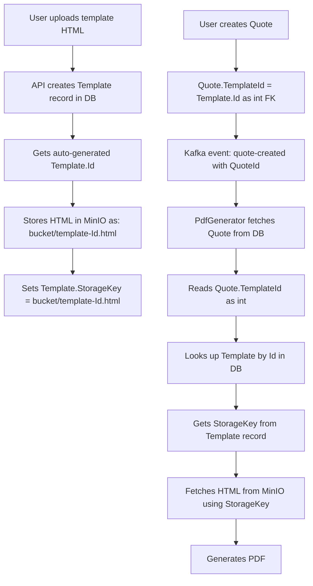

# Template ID-Based Linking Refactor Plan

## Problem Statement

The current codebase uses **template names** (strings) to link Quotes/Invoices to their templates in MinIO storage. This creates several vulnerabilities:

1. **Name collision in MinIO** — uploading a template with the same name silently overwrites the existing one
2. **Version mismatch** — DB supports `(Name, Version)` uniqueness but MinIO object keys don't include version, so `v1` and `v2` of the same template overwrite each other
3. **No referential integrity** — `Quote.TemplateId` and `Invoice.TemplateId` are loose `string?` fields with no FK constraint
4. **Two disconnected identity systems** — the `Templates` table has an auto-increment `Id` that nothing in the quote/invoice pipeline actually uses

## Proposed Solution

Make `Templates.Id` the single source of truth for template identity. Use it as:
- The FK on `Quote` and `Invoice` records
- Part of the MinIO object key for uniqueness
- The lookup key during PDF generation



## Affected Files

### Layer 1: Database Schema

| File | Change |
|------|--------|
| `shared/Shared.Database/Models/Quote.cs` | Change `TemplateId` from `string?` to `int?`, add FK attribute |
| `shared/Shared.Database/Models/Invoice.cs` | Change `TemplateId` from `string?` to `int?`, add FK attribute |
| `shared/Shared.Database/Models/Template.cs` | Add `TemplateType` enum property to distinguish invoice vs quote; Add `OrganizationId` (int, required) with FK to `Organizations` table |
| `shared/Shared.Database/Data/ApplicationDbContext.cs` | Add FK configuration for Quote.TemplateId, Invoice.TemplateId, and Template.OrganizationId |
| New migration file | EF migration for all schema changes |

### Layer 2: PdfGeneratorService — Storage

| File | Change |
|------|--------|
| `apps/client/backend/PdfGeneratorService/Services/Storage/MinioStorageService.cs` | `UploadTemplateAsync` and `UploadQuoteTemplateAsync` accept an `int templateId` and use `template-{id}.html` as object key |
| `apps/client/backend/PdfGeneratorService/Services/Storage/IMinioStorageService.cs` | Update interface signatures |

### Layer 3: PdfGeneratorService — Generation

| File | Change |
|------|--------|
| `apps/client/backend/PdfGeneratorService/Services/Generation/PdfGenerationService.cs` | `GeneratePdfFromInvoiceAsync` and `GeneratePdfFromQuoteAsync` accept `int? templateId`, look up Template by ID in DB, then fetch HTML by StorageKey |
| `apps/client/backend/PdfGeneratorService/BackgroundServices/InvoiceCreatedConsumer.cs` | Pass `invoice.TemplateId` as `int?` to PDF service |
| `apps/client/backend/PdfGeneratorService/BackgroundServices/QuoteCreatedConsumer.cs` | Pass `quote.TemplateId` as `int?` to PDF service |
| `apps/client/backend/PdfGeneratorService/BackgroundServices/MinioInitializationService.cs` | Seed default templates into DB if not exists, use ID-based object keys |

### Layer 4: InvoiceTrackerApi — Services

| File | Change |
|------|--------|
| `apps/client/backend/InvoiceTrackerApi/Services/Template/TemplateService.cs` | `CreateTemplateAsync` — accept `organizationId`, create DB record first, then use ID for MinIO object key; `GetTemplatesAsync` — filter by organizationId |
| `apps/client/backend/InvoiceTrackerApi/Services/Template/ITemplateService.cs` | Update interface to include `organizationId` parameter on create and list methods |
| `apps/client/backend/InvoiceTrackerApi/Services/Quote/QuoteService.cs` | Validate `TemplateId` exists in Templates table and belongs to the same organization before creating quote |
| `apps/client/backend/InvoiceTrackerApi/Services/Invoice/InvoiceService.cs` | Validate `TemplateId` exists in Templates table and belongs to the same organization before creating invoice |

### Layer 5: InvoiceTrackerApi — DTOs and Mappers

| File | Change |
|------|--------|
| `apps/client/backend/InvoiceTrackerApi/DTOs/Quote/Requests/CreateQuoteRequest.cs` | `TemplateId` → `int?` |
| `apps/client/backend/InvoiceTrackerApi/DTOs/Quote/Requests/UpdateQuoteRequest.cs` | `TemplateId` → `int?` |
| `apps/client/backend/InvoiceTrackerApi/DTOs/Quote/Responses/QuoteResponse.cs` | `TemplateId` → `int?` |
| `apps/client/backend/InvoiceTrackerApi/DTOs/Invoice/Requests/CreateInvoiceRequest.cs` | `TemplateId` → `int?` |
| `apps/client/backend/InvoiceTrackerApi/DTOs/Invoice/Requests/UpdateInvoiceRequest.cs` | `TemplateId` → `int?` |
| `apps/client/backend/InvoiceTrackerApi/DTOs/Invoice/Requests/ConvertQuoteToInvoiceRequest.cs` | `TemplateId` → `int?` |
| `apps/client/backend/InvoiceTrackerApi/DTOs/Invoice/Responses/InvoiceResponse.cs` | `TemplateId` → `int?` |
| `apps/client/backend/InvoiceTrackerApi/DTOs/Template/Requests/CreateTemplateRequest.cs` | Add `OrganizationId` field (or derive from auth context) |
| `apps/client/backend/InvoiceTrackerApi/DTOs/Template/Responses/TemplateResponse.cs` | Add `OrganizationId` and `TemplateType` fields |
| `apps/client/backend/InvoiceTrackerApi/Mappers/QuoteMappingExtensions.cs` | Update mapping for int TemplateId |
| `apps/client/backend/InvoiceTrackerApi/Mappers/InvoiceMappingExtensions.cs` | Update mapping for int TemplateId |
| `apps/client/backend/InvoiceTrackerApi/Mappers/TemplateMappingExtensions.cs` | Update mapping to include OrganizationId and TemplateType |

### Layer 6: InvoiceTrackerApi — Controllers

| File | Change |
|------|--------|
| `apps/client/backend/InvoiceTrackerApi/Controllers/QuoteController.cs` | `GetTemplates` returns `List<TemplateResponse>` filtered by quote type and organizationId instead of `List<string>` |
| `apps/client/backend/InvoiceTrackerApi/Controllers/InvoiceController.cs` | `GetTemplates` returns `List<TemplateResponse>` filtered by invoice type and organizationId instead of `List<string>` |
| `apps/client/backend/InvoiceTrackerApi/Controllers/TemplateController.cs` | `GetTemplates` and `CreateTemplate` pass organizationId from auth context; filter templates by organization |

### Layer 7: Frontend

| File | Change |
|------|--------|
| `apps/client/frontend/src/components/modals/NewQuoteModal.vue` | Template dropdown shows template objects with `{id, name}`, sends `int` templateId |
| `apps/client/frontend/src/components/modals/NewInvoiceModal.vue` | Template dropdown shows template objects with `{id, name}`, sends `int` templateId |
| `apps/client/frontend/src/components/Layout.vue` | `saveNewInvoice` and `saveNewQuote` pass `int` templateId |
| `apps/client/frontend/src/services/api.ts` | Update `quoteApi.getTemplates()` and `invoiceApi.getTemplates()` return types |
| `apps/client/frontend/src/api/generated/api-client.ts` | Regenerate from updated API spec — `templateId` becomes `number` in all DTOs |

## Implementation Order

The refactor should be done bottom-up to avoid breaking the running system:

### Phase 1: Database Schema Changes
1. Add `TemplateType` enum and property to `Template` model
2. Add `OrganizationId` (int, required) with FK to `Organizations` table on `Template` model
3. Change `Quote.TemplateId` from `string?` to `int?` with FK to `Templates.Id`
4. Change `Invoice.TemplateId` from `string?` to `int?` with FK to `Templates.Id`
5. Update `ApplicationDbContext.OnModelCreating` with FK configurations for Template.OrganizationId, Quote.TemplateId, Invoice.TemplateId
6. Create and apply EF migration

### Phase 2: Storage Layer
6. Update `IMinioStorageService` — add `int templateId` parameter to upload methods
7. Update `MinioStorageService` — use `template-{id}.html` as object key
8. Update `MinioInitializationService` — seed default templates into DB, use ID-based keys

### Phase 3: PDF Generation Pipeline
9. Update `PdfGenerationService` — accept `int? templateId`, look up Template by ID, fetch by StorageKey
10. Update `InvoiceCreatedConsumer` — pass `int?` templateId
11. Update `QuoteCreatedConsumer` — pass `int?` templateId

### Phase 4: API Layer
12. Update all DTOs to use `int?` for TemplateId; add `OrganizationId` and `TemplateType` to template DTOs
13. Update mapping extensions
14. Update `TemplateService.CreateTemplateAsync` — accept organizationId, create DB record first, then upload with ID
15. Update `TemplateService.GetTemplatesAsync` — filter by organizationId
16. Update `QuoteService` and `InvoiceService` — validate TemplateId FK exists and belongs to same organization
17. Update `TemplateController`, `QuoteController`, and `InvoiceController` — pass organizationId from auth context; GetTemplates returns filtered Template objects

### Phase 5: Frontend
17. Update `NewQuoteModal` and `NewInvoiceModal` — template objects instead of strings
18. Update `Layout.vue` — pass int templateId
19. Regenerate API client types
20. Update `Templates.vue` if needed

### Phase 6: Data Migration
21. Migrate existing MinIO objects to ID-based keys
22. Update existing Template DB records with new StorageKeys
23. Update existing Quote/Invoice records with correct int TemplateIds

## Key Design Decisions

### TemplateType Enum
```csharp
public enum TemplateType
{
    Invoice,
    Quote
}
```
This allows the `GetTemplates` endpoints on Quote and Invoice controllers to filter by type from the DB instead of calling the PdfGeneratorService to list MinIO objects.

### MinIO Object Key Format
- **Before**: `QuoteTemplate.html` — name-based, collision-prone
- **After**: `template-{id}.html` — ID-based, guaranteed unique

### StorageKey Format
- **Before**: `quote-templates/QuoteTemplate.html`
- **After**: `quote-templates/template-{id}.html`

### Backward Compatibility
The migration needs to:
1. Rename existing MinIO objects from name-based to ID-based keys
2. Convert existing `string` TemplateId values on Quotes/Invoices to the corresponding `int` Template.Id
3. The default templates seeded by `MinioInitializationService` should be created in the DB first, then uploaded with their IDs
